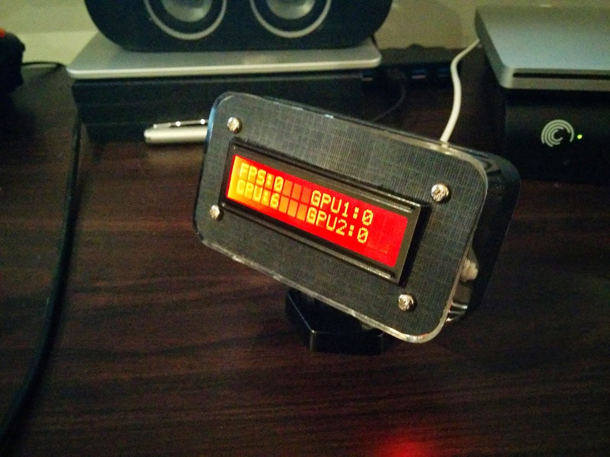
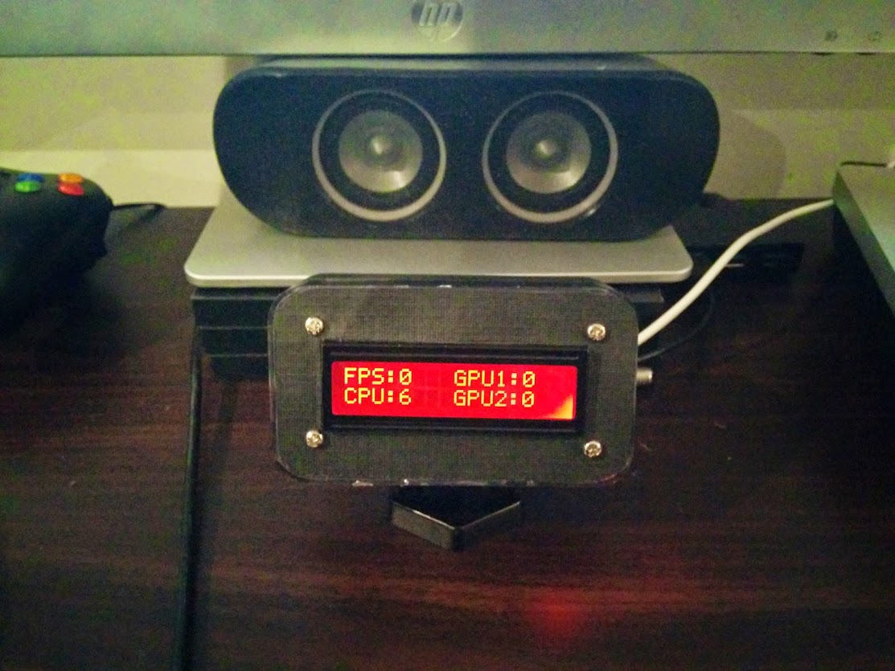
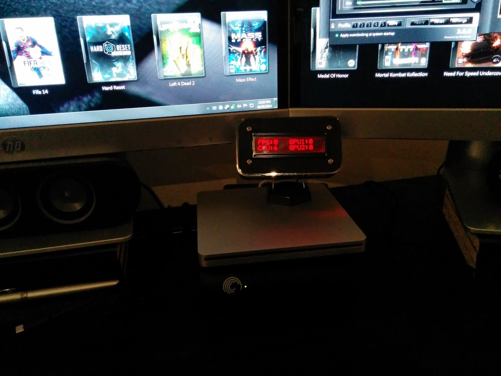
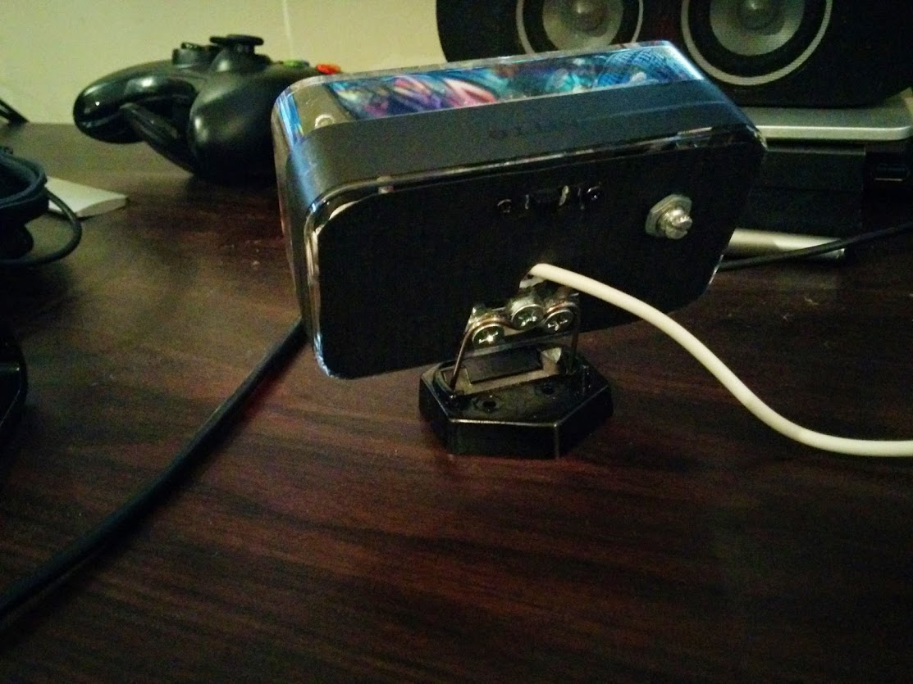

[](https://travis-ci.org/SuperEvenSteven/afterburner/builds)
[](https://opensource.org/licenses/mit-license.php)
# Afterburner

This is a Java-FX(v12) based desktop application (Windows/Linux) that connects the MSI Afterburner server and forwards the published statistics to an Arduino-based LCD device. 

### What does it do? ###
It sends MSI Afterburner monitoring statistics to an Ardiuno based device over USB serial.

### How does it work? ###
There are three parts to this project :

1. An Arduino device with a 16x2 display (but not limited to)
2. My afterburner client application which is installed on the Windows PC to be monitored (this project code)
3. MSI Afterburner GUI & MSI Afterburner Remote Server installed on the Windows PC to be monitored

This basic diagram attempts to describe those parts :


It sends serial messages over a configured comms port and these messages can be used however the ardiuno device likes i.e. LCD display, LEDs, speaker alerts, fan power control module, your imagination. The ardiuno coding part is for you to write depending on what stats it receives. I've just used the simple LCD serial example provided by Ardiuno. This was perfect for my device where I just wanted to display any receved serial messages straight to my LCD 16x2 character display.

The MSI Afterburner GUI & Remote Server application are available on the [MSI Afterburner website](http://event.msi.com/vga/afterburner/overview.htm). This code is currently capable of interfacing with MSI Afterburner versions : 

* MSI Afterburner GUI Version 4.0.0.4606
* MSI Afterburner Remote Server v1.2.0.0

### Requirements ###

* Install JDK 11
* Install maven 3.0
* Install the appropriate Arduino IDE and serial drivers for your device
* Install MSI Afterburner & MSI Afterburner Remote Server

### Configuration ###
Modify the configuration file /src/main/resources/configuration.properties and set the following : 

* **IP address and port** - that the MSI Afterburner Remote Server is listening on. 
* **Password** - I've included the default password that is provided by the Remote Server but you can modify this in the app and adjust it here also.
* **Comms Port** - this is the port that the Arduino devcie is listening on. For windows it would be something like "COMM1" on linux it'd be something like /dev/XYZBLAH.
* **Maxmium characters for a serial message** : by default I've left it at 32 since I used a 16x2 character display. 

### Serial Libraries Linux ###
This is only required if yo plan to run this on a Linux box and remotely access your gaming PC. In order to access the serial comms port for Linux you need to install librxtxjava and you need to grant permissions for access on that port. In the case of the Teensy device I used I had to add the udev rules specified on the Teensy website : https://www.pjrc.com/teensy/49-teensy.rules

To install the serial linux libraries:

```bash
sudo apt-get install librxtx-java
```

You then make a reference to RXTXcomm.jar on your classpath which is found under /usr/share/java/RXTXcomm.jar.

### Compiling ###
To compile and generate an executable fat jar run : 

```bash
mvn clean package
```
### Installation ###
Copy the executable JAR ```afterburner/afterburner-client/target/afterburner-client-bundled-1.0.0-SNAPSHOT.jar``` to the PC running MSI Afterburner & Remote Server in order to run this client application.

### Running the Application ###

Start up both the MSI Afterburner & Remote server applications.

Open up a Windows command prompt and run the jar.


```bash
javaw.exe -jar afterburner-client-bundled-1.0.0-SNAPSHOT.jar
```

Observe the terminal output and ensure that you not only see key/value pair listings of Afterburner stats but that it's able to access and publish to the configured comms port.

### LCD Displays & Serial Messages ###

The MessasgeWriter class is specifically coded to display 4 items on a screen each 8 characters long and padded with whitespace. If you want to display stats to a larger screen 40x4 etc. you'd need to set the max character property in the config file and modify the MessageWriter to display the stats you're interested in and also in the format you'd wish them to be viewed.

The default message the MessageWriter sends will contain stats for :

* FPS - framerate
* GPU1 - gpu 1 load percentage
* GPU2 - gpu 2 load percentage
* CPU - average cpu load for all cores
* TMP - average cpu temp for all cores

It looks like this :


```
FPS:60  GPU1:88
CPU:99  GPU2:79
```

**Note 1** : If you haven't configured MSI Afterburner to display framerate a TEMP stat will be displayed instead. 

```
TMP:47  GPU1:88
CPU:99  GPU2:79
```

**Note 2** : If you have a single gfx card then it will display RAM usage instead.

```
FPS:60  GPU1:88
CPU:99  RAM:2305
```

### Customisation ###
If you want to add statistics not already exposed by this application, you can modify the [schema](afterburner/src/main/resources/schema.xsd). Once you generate sources ```mvn generate-sources``` the new JAXB generated classes will be available for use as Java objects.

## License
For all files in this repository that don't contain explicit licensing, the MIT license then applies. See the accompanying LICENSE for more details.. Use of the MSI Afterburner software including extensions/tools fall under their own respective license(s) as defined by Micro-Star International.

### Who do I talk to? ###

* Stephen O'Hair - stephen.ohair@gmail.com

### More Ardiuno Pics ###
I used a Teensy to build this device. The plastic housing is an old ipod nano box and the stand is a cheap soldering iron stand. I cut out cardboard templates for the front and back and sealed it with black electrical tape.




